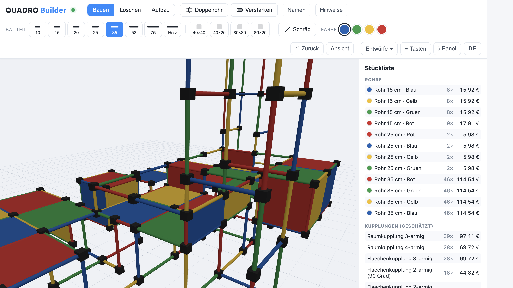
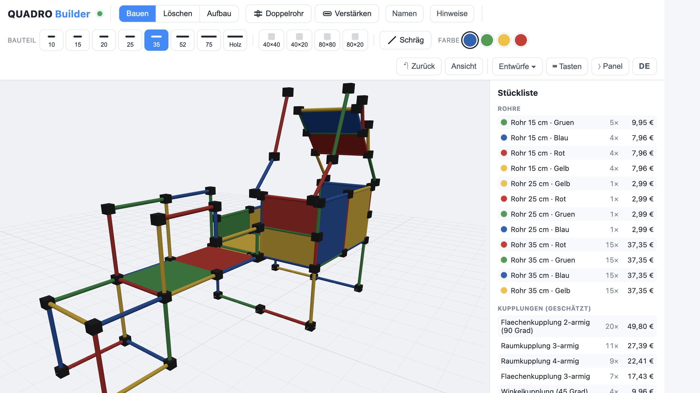
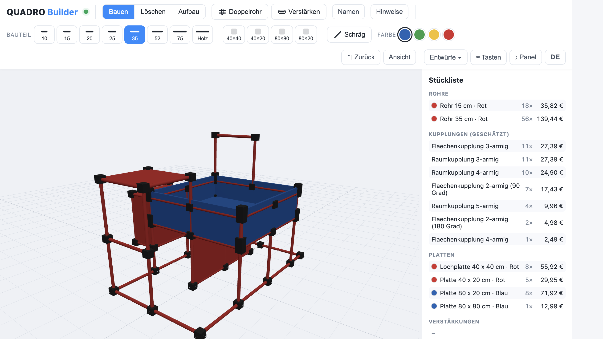
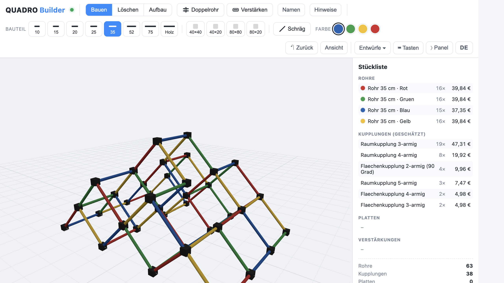
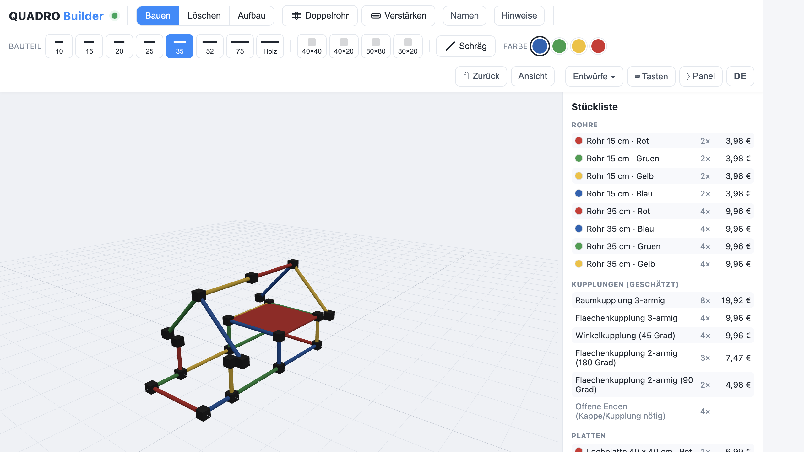
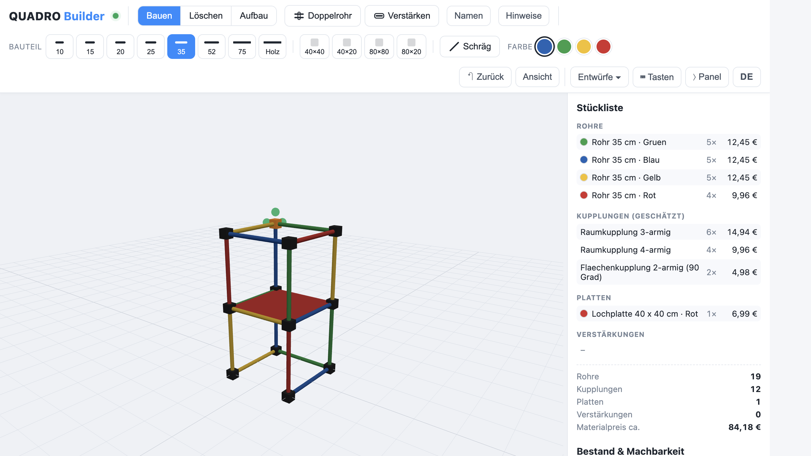
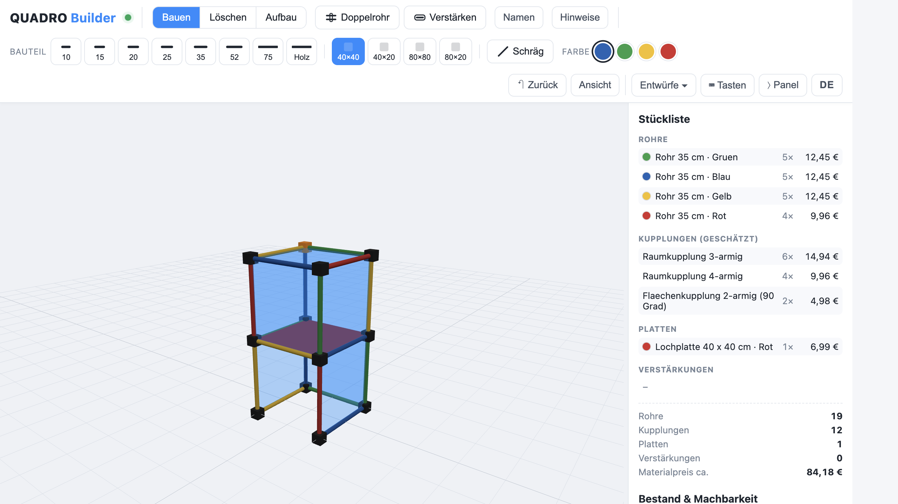
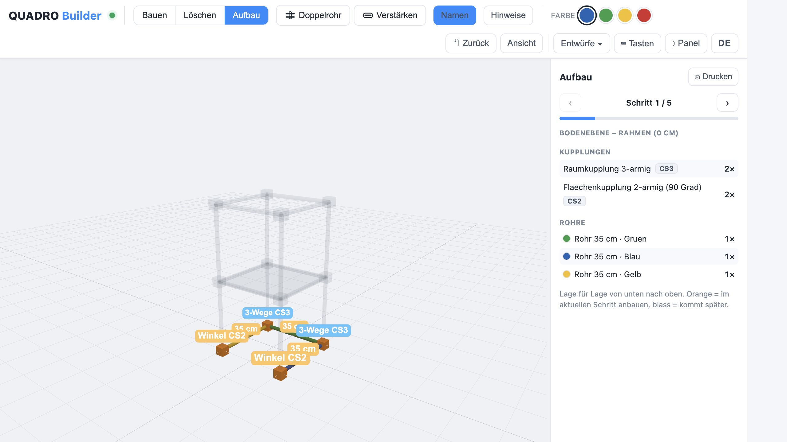
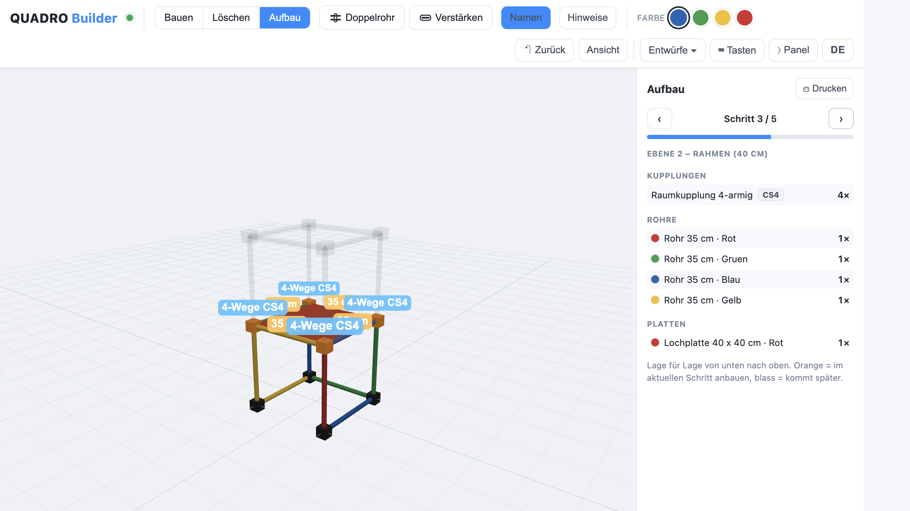
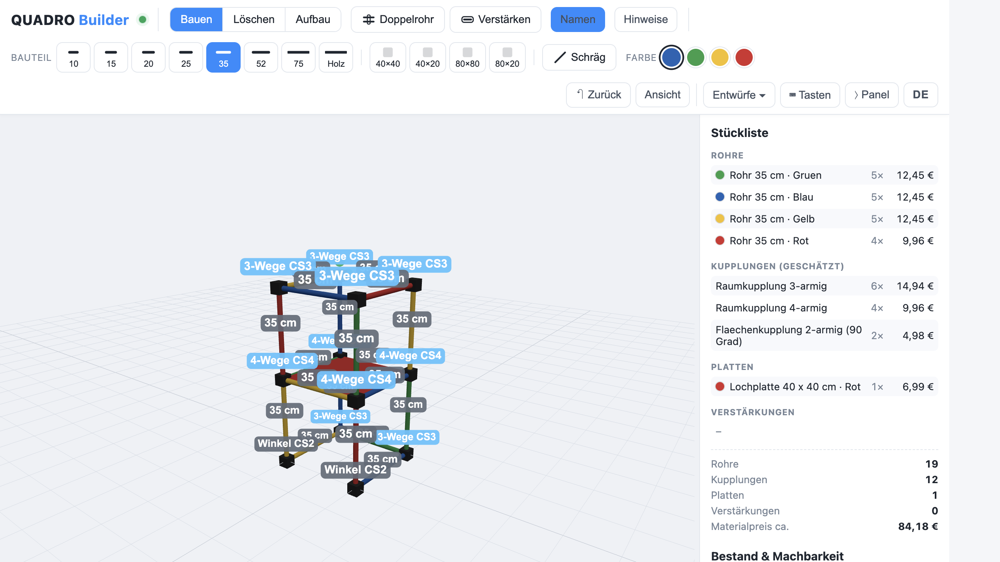

<div align="center">

# 🏗️ Quadro Builder

**3D-Planungstool für QUADRO-Klettergerüste · 3D planning tool for QUADRO climbing frames**

[](LICENSE)
[](web/js/)
[](web/vendor/three/)
[](https://pages.github.com)

[🇩🇪 Deutsch](#-deutsch) · [🇬🇧 English](#-english)

</div>

---

## 🇩🇪 Deutsch

### Was ist das?

Quadro Builder ist eine moderne, **offline-fähige Web-App** zum Planen von [QUADRO-Klettergerüsten](https://quadroshop.com) – entstanden als Nachbau der alten Windows-Software „Quadro 3D".

Der Anlass: Die originale Software wirkt heute sehr altmodisch, die Kamerasteuerung ist umständlich und eine saubere Schritt-für-Schritt-Aufbauanleitung fehlt dort ganz. Genau das sollte der Quadro Builder besser machen.

Man baut ein Gerüst frei im **3D-Raum** aus Kupplungen und Rohren und bekommt sofort:
- eine **Live-Stückliste** mit geschätztem Materialpreis
- einen automatischen **Machbarkeitscheck** gegen den eigenen Teile-Bestand
- einen ebenenweisen **Aufbauplan** zum tatsächlichen Zusammenbauen

Keine Installation, kein Account, keine Cloud – alles läuft lokal im Browser.

### Vorschau

**Beispiel-Projekte**

<table>
<tr>
<td></td>
<td></td>
</tr>
<tr>
<td align="center"><sub>Großes Gerüst mit Live-Stückliste</sub></td>
<td align="center"><sub>Platten und schräge Streben kombiniert</sub></td>
</tr>
<tr>
<td></td>
<td></td>
</tr>
<tr>
<td align="center"><sub>Platten (40×40, 40×20, 80×40, 80×80)</sub></td>
<td align="center"><sub>Rampen und schräge Streben (45°)</sub></td>
</tr>
<tr>
<td></td>
<td></td>
</tr>
<tr>
<td align="center"><sub>Einfaches Haus als Einstieg</sub></td>
<td></td>
</tr>
</table>

**Modi**

<table>
<tr>
<td></td>
<td></td>
</tr>
<tr>
<td align="center"><sub>Bauen-Modus – grüne Punkte zeigen freie Richtungen</sub></td>
<td align="center"><sub>Platten-Modus – freie Felder blau markiert</sub></td>
</tr>
<tr>
<td></td>
<td></td>
</tr>
<tr>
<td align="center"><sub>Aufbaumodus – Bodenebene (Schritt 1)</sub></td>
<td align="center"><sub>Aufbaumodus – Ebene 2 mit Platte (Schritt 3)</sub></td>
</tr>
<tr>
<td></td>
<td></td>
</tr>
<tr>
<td align="center"><sub>Namen-Modus – Kupplungstypen direkt im 3D-Modell beschriftet</sub></td>
<td></td>
</tr>
</table>

### Features

- **3D-Editor** – frei im Raum bauen mit Kupplungen, Rohren und Platten
- **Tastatursteuerung** – Pfeiltasten, Shortcuts für alle Aktionen (sieh `⌨ Tasten` in der App)
- **Live-Stückliste** – Kupplungstyp-Heuristik, Materialpreise, Gesamtkosten
- **Bestand & Machbarkeit** – eintragen was man hat, sofort sehen ob's reicht
- **Aufbaumodus** – Lage für Lage durch den Bauplan navigieren, drucken
- **Platten** – 40×40 und 40×20 auf erkannte Felder einsetzen
- **Schräge Streben** – 45°-Elemente für Rampen und Verstrebungen
- **Alu-Verstärkungen** – Profile in Rohre einsetzen, kollineare Läufe zusammenfassen
- **QDF-Import** – Entwürfe aus der Original-QUADRO-Software laden
- **Autosave + benannte Entwürfe** – Daten bleiben im Browser erhalten
- **JSON-Export/Import** – echte Offline-Sicherung als Datei
- **Zweisprachig** – Deutsch und Englisch (Sprache wechseln mit dem DE/EN-Button)
- **GitHub Pages ready** – läuft ohne Server direkt aus dem Repository

### Schnellstart

#### Option A: GitHub Pages (kein Setup nötig)

Die App ist direkt unter der GitHub-Pages-URL erreichbar – einfach den Link aufrufen, fertig. Keine Installation, kein Python, kein Terminal.

> Für eigene Änderungen: Fork erstellen → Pages aktivieren (Settings → Pages → Branch `main`, Ordner `/`) → fertig.

#### Option B: Lokal mit Python

Voraussetzung: **Python 3** (auf macOS vorinstalliert).

```bash
git clone https://github.com/k3mpaxl/Quadro-Builder.git
cd Quadro-Builder
python serve.py
```

Der Browser öffnet automatisch `http://127.0.0.1:8000/web/index.html`.

> **Hinweis:** Bitte immer über `serve.py` öffnen, nicht per Doppelklick auf `index.html`. Browser blockieren ES-Module und `fetch()` unter dem `file://`-Protokoll.

Three.js liegt lokal unter `web/vendor/` – **keine Internetverbindung nötig**.

### Bedienung

| Aktion | Beschreibung |
|--------|-------------|
| **Kupplung klicken** | auswählen, grüne Punkte zeigen freie Richtungen |
| **Grünen Punkt klicken** | Rohr + neue Kupplung in diese Richtung |
| **Pfeiltasten** | Rohr in Blickrichtung verlegen |
| **Bild↑ / Bild↓ oder +/−** | Rohr nach oben / unten |
| **1–8** | Rohrlänge wählen |
| **B / X / A** | Modus: Bauen / Löschen / Aufbau |
| **Ziehen (Drag)** | Kamera drehen |
| **Scrollen** | Zoom |
| **Strg/Cmd + Z** | Rückgängig |
| **C** | Kamera zurücksetzen |
| **Entwürfe ▾** | Speichern, Laden, Export, Import |

Alle Shortcuts: Button **⌨ Tasten** in der Toolbar.

### Projektstruktur

```
Quadro-Builder/
├── index.html               # Root-Redirect → web/index.html (für GitHub Pages)
├── serve.py                 # Lokaler Entwicklungsserver (Python-Standardbibliothek)
├── .nojekyll                # GitHub Pages: Jekyll deaktivieren
├── data/
│   └── parts.json           # Teile-Katalog (Kupplungen, Rohre, Platten, Preise)
└── web/
    ├── index.html           # App-Shell + ES-Module-Importmap
    ├── css/style.css
    ├── js/
    │   ├── main.js          # Bootstrap: Katalog → Scene → Model → Builder → UI
    │   ├── config.js        # Konstanten (Richtungen, Toleranzen, Keys)
    │   ├── i18n.js          # Übersetzungen DE/EN, t()-Funktion
    │   ├── catalog.js       # Lädt und kapselt parts.json
    │   ├── model.js         # Datenmodell (Graph, kein Three.js)
    │   ├── scene.js         # Three.js: Rendering, Kamera, Handles
    │   ├── builder.js       # Bau-Interaktion: Setzen, Löschen, Modi
    │   ├── bom.js           # Stückliste + Kupplungstyp-Heuristik + Machbarkeit
    │   ├── buildplan.js     # Aufbauplan: ebenenweise Bauschritte
    │   ├── qdfimport.js     # QDF-Import: Entwürfe aus Quadro 3D einlesen
    │   ├── storage.js       # localStorage + Datei-Export/Import
    │   └── ui.js            # Toolbar, Panels, Tastatur-Handler
    └── vendor/three/        # Three.js r160 + OrbitControls (lokal, offline)
```

### Wie das Modell funktioniert

Ein Bauwerk ist ein **Graph**: Kupplungen sind Knoten (x/y/z in cm), Rohre sind Kanten. Neue Knoten **verschmelzen automatisch**, wenn ein Rohr genau dort endet, wo schon eine Kupplung sitzt – geschlossene Rahmen entstehen ohne doppelte Teile.

Den **Kupplungstyp** leitet die Stückliste aus Anzahl und Lage der angeschlossenen Rohre ab (z. B. 3 Rohre in einer Ebene → Flächenkupplung 3-armig). Für achsenparallele Bauten ist das exakt.

### Teile & Preise anpassen

Alle Teile, Maße und Preise stecken in `data/parts.json`. Neue gerade Rohre mit `"buildable": true` und `"length_cm"` erscheinen **automatisch als Button** in der App – kein Code nötig. Preise und Abmessungen können dort direkt angepasst werden.

### Roadmap

- [ ] **Schräge Teile & Rampen** – 45°-Winkelkupplungen, Knick-/Bogenrohre *(größter Schwachpunkt der Originalsoftware)*
- [ ] **Weitere Platten** – 30×30, Lochplatten, Wandplatten
- [ ] **Einkaufsliste** – „Was fehlt noch?" als Exportfunktion
- [ ] **2D-Plan / PDF-Export** – Drauf- und Seitenansicht zum Drucken
- [ ] **Django-Backend** *(optional)* – Konten, geräteübergreifendes Speichern, geteilte Datenbank
- [x] Stückliste mit Kupplungstyp-Heuristik
- [x] Bestand & Machbarkeitscheck
- [x] Aufbaumodus (Lage für Lage)
- [x] Platten 40×40 und 40×20
- [x] Schräge Streben (45°)
- [x] Alu-Verstärkungen
- [x] QDF-Import (Original-QUADRO-Software)
- [x] Zweisprachig (DE/EN)
- [x] GitHub Pages

### Mitmachen

Contributions sind willkommen – egal ob Bugfix, neues Feature oder Verbesserung der Teile-Daten. Bitte lies vorher [`CONTRIBUTING.md`](CONTRIBUTING.md).

Bugs und Ideen: [Issue öffnen](../../issues) oder Pull Request erstellen.

### Lizenz

[MIT](LICENSE) – frei verwendbar, auch kommerziell.

---

## 🇬🇧 English

### What is it?

Quadro Builder is a modern, **offline-capable web app** for planning [QUADRO climbing frames](https://quadroshop.com) – built as a reimagining of the old Windows software "Quadro 3D".

The motivation: the original software feels very dated today, the camera controls are cumbersome, and a proper step-by-step assembly guide is missing entirely. Quadro Builder was created to address exactly those shortcomings.

Build a frame freely in **3D space** using connectors and tubes and instantly get:
- a **live bill of materials** with estimated material costs
- an automatic **feasibility check** against your own parts inventory
- a layer-by-layer **assembly guide** for the actual build

No installation, no account, no cloud – everything runs locally in the browser.

### Preview

**Example projects**

<table>
<tr>
<td></td>
<td></td>
</tr>
<tr>
<td align="center"><sub>Large frame with live bill of materials</sub></td>
<td align="center"><sub>Panels and diagonal braces combined</sub></td>
</tr>
<tr>
<td></td>
<td></td>
</tr>
<tr>
<td align="center"><sub>Panels (40×40, 40×20, 80×40, 80×80)</sub></td>
<td align="center"><sub>Ramps and diagonal braces (45°)</sub></td>
</tr>
<tr>
<td></td>
<td></td>
</tr>
<tr>
<td align="center"><sub>Simple house as a starter example</sub></td>
<td></td>
</tr>
</table>

**Modes**

<table>
<tr>
<td></td>
<td></td>
</tr>
<tr>
<td align="center"><sub>Build mode – green dots show free directions</sub></td>
<td align="center"><sub>Panel mode – free cells highlighted in blue</sub></td>
</tr>
<tr>
<td></td>
<td></td>
</tr>
<tr>
<td align="center"><sub>Assembly mode – ground level (step 1)</sub></td>
<td align="center"><sub>Assembly mode – level 2 with panel (step 3)</sub></td>
</tr>
<tr>
<td></td>
<td></td>
</tr>
<tr>
<td align="center"><sub>Label mode – connector types shown directly in 3D model</sub></td>
<td></td>
</tr>
</table>

### Features

- **3D editor** – build freely in space with connectors, tubes and panels
- **Keyboard control** – arrow keys, shortcuts for all actions (see `⌨ Keys` in the app)
- **Live bill of materials** – connector type heuristics, material prices, total cost
- **Inventory & feasibility** – enter what you own, instantly see if it's enough
- **Assembly mode** – navigate layer by layer through the build plan, print it
- **Panels** – place 40×40 and 40×20 panels on detected fields
- **Diagonal braces** – 45° elements for ramps and cross-bracing
- **Aluminium reinforcements** – insert profiles into tubes, collinear runs merged
- **QDF import** – load designs from the original QUADRO software
- **Autosave + named designs** – data persists in the browser
- **JSON export/import** – true offline backup as a file
- **Bilingual** – German and English (switch with the DE/EN button)
- **GitHub Pages ready** – runs without a server directly from the repository

### Quick Start

#### Option A: GitHub Pages (no setup required)

The app is available directly at the GitHub Pages URL – just open the link and go. No installation, no Python, no terminal.

> For your own changes: fork the repo → enable Pages (Settings → Pages → Branch `main`, folder `/`) → done.

#### Option B: Local with Python

Requirement: **Python 3** (pre-installed on macOS).

```bash
git clone https://github.com/k3mpaxl/Quadro-Builder.git
cd Quadro-Builder
python serve.py
```

The browser automatically opens `http://127.0.0.1:8000/web/index.html`.

> **Note:** Always open via `serve.py`, not by double-clicking `index.html`. Browsers block ES modules and `fetch()` under the `file://` protocol.

Three.js is bundled locally under `web/vendor/` – **no internet connection required**.

### Usage

| Action | Description |
|--------|-------------|
| **Click connector** | select it; green dots show free directions |
| **Click green dot** | place tube + new connector in that direction |
| **Arrow keys** | place tube in camera direction |
| **Page Up / Down or +/−** | tube up / down |
| **1–8** | select tube length |
| **B / X / A** | mode: Build / Delete / Assembly |
| **Drag** | rotate camera |
| **Scroll** | zoom |
| **Ctrl/Cmd + Z** | undo |
| **C** | reset camera |
| **Designs ▾** | save, load, export, import |

All shortcuts: click the **⌨ Keys** button in the toolbar.

### Project Structure

```
Quadro-Builder/
├── index.html               # Root redirect → web/index.html (for GitHub Pages)
├── serve.py                 # Local dev server (Python standard library only)
├── .nojekyll                # GitHub Pages: disable Jekyll processing
├── data/
│   └── parts.json           # Parts catalogue (connectors, tubes, panels, prices)
└── web/
    ├── index.html           # App shell + ES module importmap
    ├── css/style.css
    ├── js/
    │   ├── main.js          # Bootstrap: catalogue → scene → model → builder → UI
    │   ├── config.js        # Constants (directions, tolerances, storage keys)
    │   ├── i18n.js          # DE/EN translations, t() function
    │   ├── catalog.js       # Loads and wraps parts.json
    │   ├── model.js         # Data model (graph, no Three.js)
    │   ├── scene.js         # Three.js: rendering, camera, handles
    │   ├── builder.js       # Build interactions: place, delete, modes
    │   ├── bom.js           # BOM + connector type heuristics + feasibility
    │   ├── buildplan.js     # Assembly plan: layer-by-layer steps
    │   ├── qdfimport.js     # QDF import: read designs from Quadro 3D
    │   ├── storage.js       # localStorage + file export/import
    │   └── ui.js            # Toolbar, panels, keyboard handler
    └── vendor/three/        # Three.js r160 + OrbitControls (local, offline)
```

### How the model works

A structure is a **graph**: connectors are nodes (x/y/z in cm), tubes are edges. New nodes **merge automatically** when a tube ends exactly where a connector already exists – closed frames are created without duplicate parts.

The **connector type** is derived by the BOM from the number and position of attached tubes (e.g. 3 tubes in one plane → flat 3-way connector). This is exact for axis-parallel structures.

### Customising Parts & Prices

All parts, dimensions and prices are in `data/parts.json`. New straight tubes with `"buildable": true` and `"length_cm"` automatically appear **as buttons** in the app – no code changes needed. Prices and dimensions can be adjusted there directly.

### Roadmap

- [ ] **Diagonal parts & ramps** – 45° angle connectors, bent/curved tubes *(biggest weakness of the original software)*
- [ ] **More panel types** – 30×30, perforated panels, wall panels
- [ ] **Shopping list** – "What's still missing?" as an export function
- [ ] **2D plan / PDF export** – top-down and side views for printing
- [ ] **Django backend** *(optional)* – accounts, cross-device saving, shared database
- [x] BOM with connector type heuristics
- [x] Inventory & feasibility check
- [x] Assembly mode (layer by layer)
- [x] Panels 40×40 and 40×20
- [x] Diagonal braces (45°)
- [x] Aluminium reinforcements
- [x] QDF import (original QUADRO software)
- [x] Bilingual (DE/EN)
- [x] GitHub Pages

### Contributing

Contributions are welcome – whether bug fixes, new features or improvements to the parts data. Please read [`CONTRIBUTING.md`](CONTRIBUTING.md) first.

Bugs and ideas: [open an issue](../../issues) or create a pull request.

### License

[MIT](LICENSE) – free to use, including commercially.
